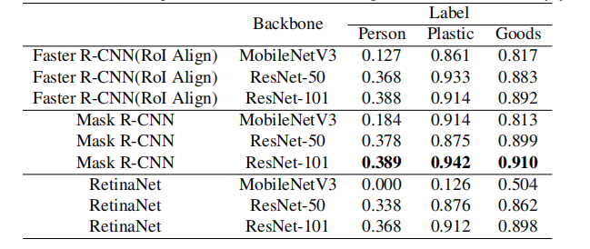

# MaskRCNN Benchmark for Skyeye dataset
This project is fork from maskrcnn-benchmark, the steps of installation, training and test are shown in
[Original README.md](./README_ORI.md).

## Skyeye dataset
The annotation of skyeye dataset.
```json
[
{"id": -1, "name": "ignore", "count": 434}, 
{"id": 1, "name": "mask_person_top", "count": 129}, 
{"id": 2, "name": "mask_plastic_3_pallet_top", "count": 18}, 
{"id": 3, "name": "mask_goods_pallet_top", "count": 1525}
]
```

## Modification for skyeye dataset 
The modification for skyeye dataset is located at [mobilenet backbone](./maskrcnn_benchmark/modeling/backbone/backbone.py),
[RPN](./maskrcnn_benchmark/modeling/rpn) and [ROI](./maskrcnn_benchmark/modeling/roi_heads).

## Main Result


The specific results can be seem from the directory whose prefix is skyeye.
